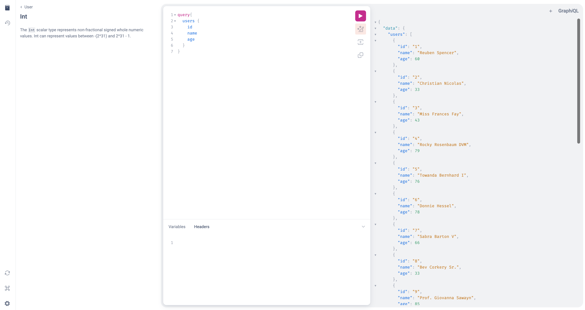

# 参考記事

- [Rails + React + GraphQL + ApolloClient で画面表示されるまでのハンズオン！](https://qiita.com/sasaki-sota/items/2f65d9bec3753d48bbc0)

# API

## 操作

`rails s`で api を起動すると、  
http://localhost:3000/graphql で query, mutation など GraphQL の操作ができる。  


## フロントからの叩き方

### REST

RESTful API の場合は、  
http://localhost:3000/users のように、  
レスポンスを API 側で指定したエンドポイントを叩いてほしいデータを取得する。

### GraphQL

http://localhost:3000/graphql に対して、  
以下のような QUERY をフロント側から送りつけてほしいレスポンスを得る。

```ts
const GET_USERS = gql`
  {
    users {
      id
      name
      age
      books {
        id
        title
        body
      }
    }
  }
`;
```

N+1 は普通に発生するが、JOIN を使うと GraphQL の思想から逸れるので、  
DataLoader を使うのが一般的。[参考](https://zenn.dev/alea12/articles/15d73282c3aacc)
